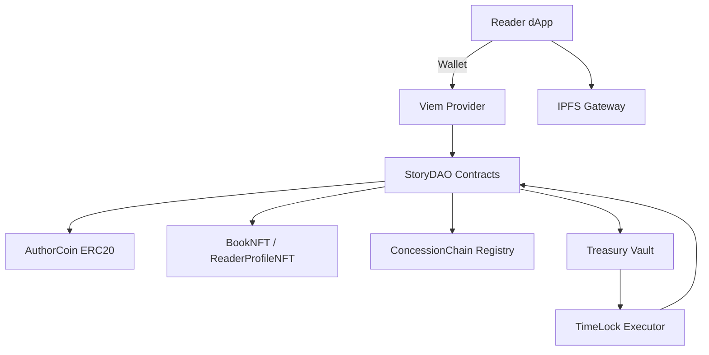
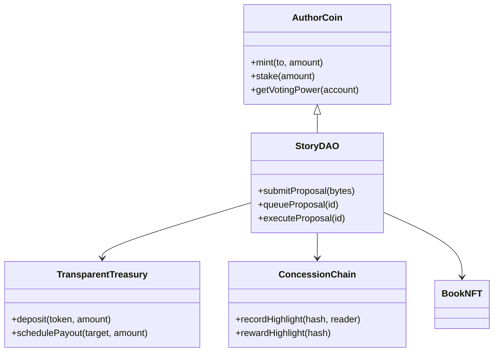

# Architecture Blueprint

**Document Version:** 1.0.0  \\
**Last Updated:** 2024-05-29

## System Overview
The Literary Sovereignty ecosystem is composed of modular smart contracts, decentralized storage integrations, and a web client for reader and author interactions. Components are designed for upgradeability, allowing StoryDAO governance to iterate on functionality without compromising security.

## Module Responsibilities
- **AuthorCoin (ERC-20):** Handles staking, emissions, and treasury inflows. Integrated with DAO voting weight calculations.
- **BookNFT / ReaderProfileNFT:** Provide unique identifiers for works and readers. Utilize metadata resolvers for off-chain content.
- **StoryDAO:** Aggregates proposals, executes timelocked transactions, and maintains quorum rules defined by governance libraries.
- **ConcessionChain Registry:** Maintains hashed records of highlights and reader consensus events.
- **TransparentTreasury:** Manages asset custody and orchestrates payouts according to DAO-approved schedules.

## Contract Relationships

## Deployment Environments
| Environment | Purpose                | Tooling             | Security Controls                  |
| ----------- | ---------------------- | ------------------- | ---------------------------------- |
| Local       | Development & testing  | Hardhat, Foundry    | Forked mainnet simulation          |
| Testnet     | User testing & audits  | Hardhat, Viem       | Timelock + multisig sign-off       |
| Mainnet     | Production             | Hardhat, Defender   | On-chain monitors + guardian veto  |

## Upgrade Process
1. Contributors draft a proposal package with ABI changes and migration scripts.
2. Proposal is submitted to StoryDAO with supporting documentation and audits.
3. Upon successful voting, the timelock queues the upgrade for delayed execution.
4. TransparentTreasury releases required funds and the proxy admin executes the new implementation.
5. Post-upgrade monitors verify invariants; deviations trigger emergency pause procedures.

## Data Flows
- **Reader Highlight:** Reader → dApp → ConcessionChain → Reward distribution via AuthorCoin staking contract.
- **Book Mint:** Author → Deployment script → BookNFT contract → Metadata pinned to IPFS.
- **Governance Action:** Delegate → StoryDAO proposal → Timelock → TransparentTreasury / proxy upgrade.

## Observability
- On-chain events streamed into a subgraph for analytics dashboards.
- Off-chain worker emits metrics to Prometheus/Grafana stack.
- Alerting thresholds triggered for abnormal treasury withdrawals or proposal spam.

## Appendix B: Module Version Matrix
| Module                 | Current Version | Notes                          |
| ---------------------- | --------------- | ------------------------------ |
| AuthorCoin             | v0.8.0-alpha    | Emission schedule draft        |
| StoryDAO               | v0.7.2-beta     | Timelock hardened              |
| ConcessionChain        | v0.5.4-alpha    | Highlight dispute resolution   |
| TransparentTreasury    | v0.6.1-beta     | Guardian roles enabled         |
| BookNFT                | v0.4.9-alpha    | Metadata resolver integration  |
| ReaderProfileNFT       | v0.3.6-alpha    | Non-transferable enforcement   |
